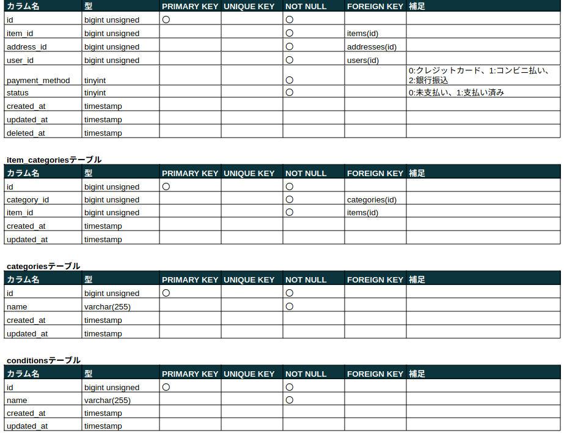

# メルカリ風フリマアプリ

メルカリ風フリマアプリ

## 作成した目的

coachtechブランドのアイテムを出品する。

## アプリケーション URL

### ローカル環境

- アプリケーション URL：http://localhost/
- phpMyAdmin：http://localhost:8080/
- mailhog：http://localhost:8025/

## 他のリポジトリ

なし

## 機能一覧

| 項目| 備考|
| - | - |
| 会員登録| 会員登録ページから会員登録ができる|
| ログイン| ログインページからログインができる|
| ログアウト| メニューからログアウトを選択することで認証情報をクリアできる|
| 商品一覧取得| 登録されている商品の一覧を取得できる|
| 商品詳細取得 | 商品の詳細を取得できる|
| 商品お気に入り一覧取得   | お気に入り登録した商品の一覧を取得できる|
| ユーザー情報取得| ユーザー情報を取得できる|
| ユーザー購入商品一覧取得| ユーザーが過去に購入した商品の一覧を取得できる|
| ユーザ出品商品一覧取得| ユーザーが出品した商品の一覧を取得できる|
| プロフィール変更| ユーザーのプロフィールを変更できる|
| 商品お気に入り追加| 商品をお気に入り登録できる|
| 商品お気に入り削除| 商品のお気に入り登録を解除できる|
| 商品コメント追加| 商品にコメントをつけることができる|
| 商品コメント削除| 商品につけたコメントを削除することができる|
| 出品| 商品を出品登録することができる|
| 配送先変更機能| 商品の配送先を変更することができる|
| 商品購入機能| Stripeを利用して決済をすることができる|
| 支払い方法の選択・変更| 支払い方法を「クレジットカード」「コンビニ」「銀行振込」から選択・変更することができる|
| README| プロダクト概要と環境構築方法を記述する|
| レスポンシブデザイン| スマートフォン用のレスポンシブデザインを作成する ブレイクポイントは768pxとする|
| 管理画面| 管理者と利用者の2つの権限を作成する 管理者側はユーザーの削除が行える管理画面を作成する 管理者は一般ユーザーのコメントを削除できる|
| メール送信| 管理画面から利用者にメールを送信することができる|
| ストレージ| 商品の画像をストレージに保存することができる|

## 使用技術(実行環境)

- PHP 7.4.9
- Laravel 8.6.12
- MySQL 8.0.35
- nginx 1.21.1
- fortify 1.19.1
- stripe/stripe-php 14.4.0
- league/flysystem 1.1.10
- mailhog

## テーブル設計

## ER 図

## 環境構築

### Docker ビルド

1. プロジェクトを取得 (terminal)  
   `git clone {URL}`
2. コンテナの作成、実行 (terminal)  
   `docker-compose up -d --build`

＊ MySQL は、OS によって起動しない場合があるのでそれぞれの PC に合わせて、docker-compose.yml ファイルを編集してください。

### 環境構築

1. PHP コンテナに入る (terminal)  
   `docker-compose exec php bash`
2. ライブラリのインストール (PHP)  
   `composer install`
3. .env.example ファイルから.env を作成し、環境変数を変更(terminal)

   - "docker-compose.yml"を参考に DB の設定を修正
   - 送信元アドレスの値(MAIL_FROM_ADDRESS)に任意の値を入力
   - STRIPE_KEY、STRIPE_SECRET の項目を追加し、Stripe にログインし、開発者向け API キーをそれぞれ入力

4. アプリケーションキーの作成 (PHP)  
   `php artisan key:generate`
5. テーブルの作成 (PHP)  
   `php artisan migrate`
6. ダミーデータの作成 (PHP)  
   `php artisan db:seed`

   - テストユーザー ID  
      email : test@user.com  
      password : password
     (/login)
   - テスト管理者 ID  
      email : test@admin.com  
      password : password
     (/admin/login)

7. ストレージディレクトリとのリンクを作成 (PHP)  
   `php artisan storage:link`

## その他
